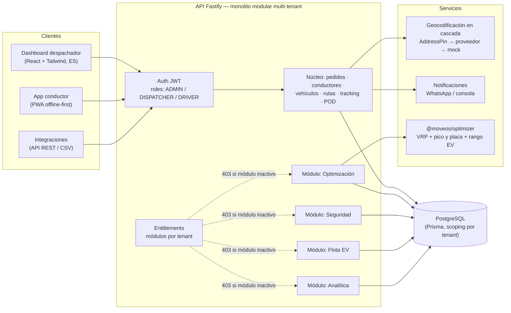
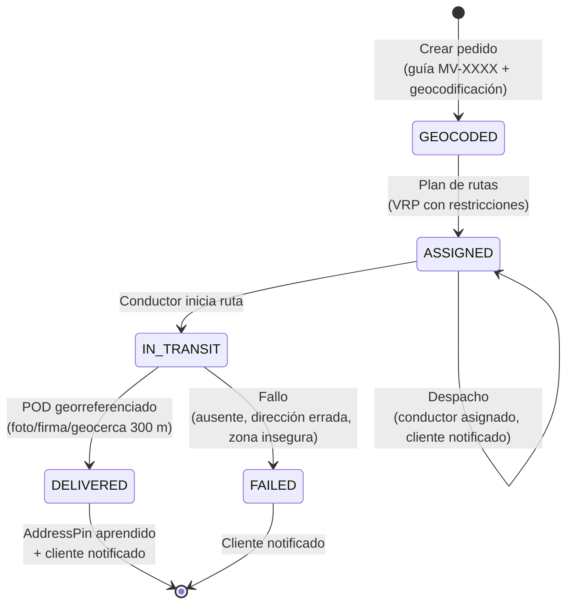
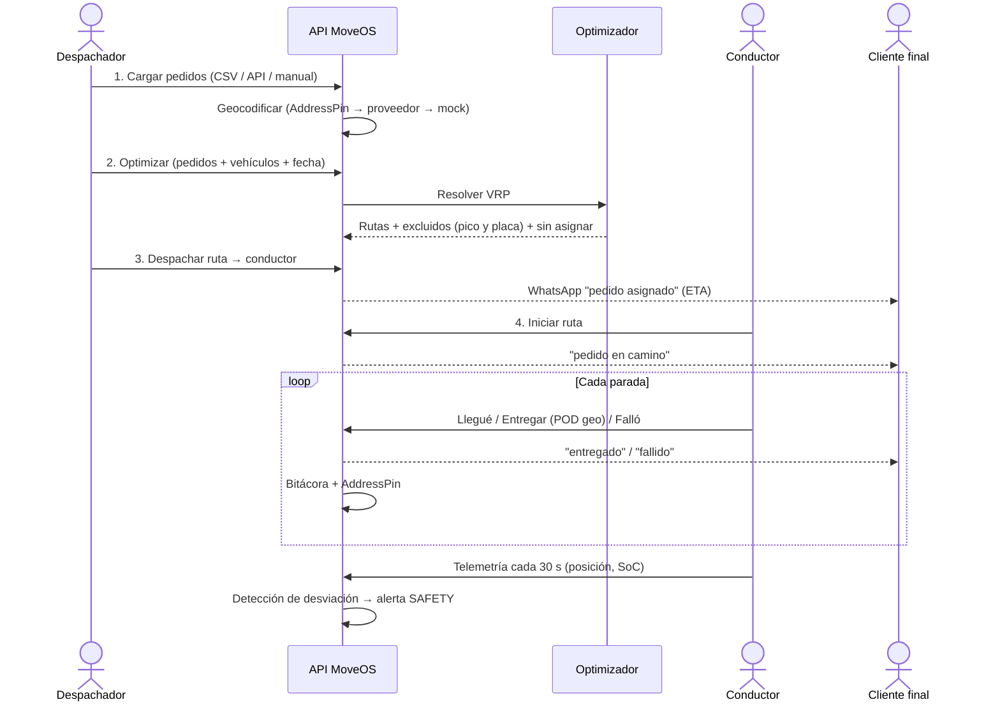
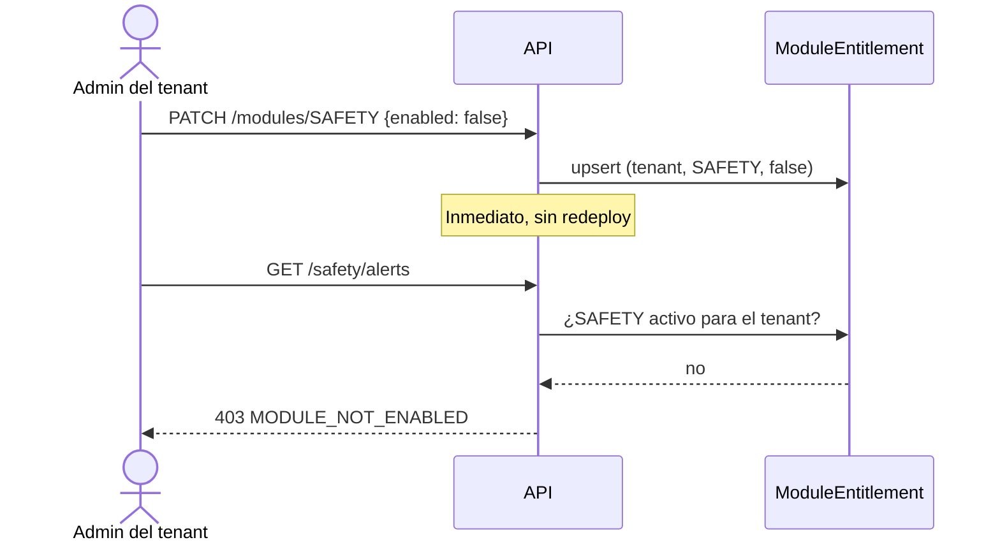
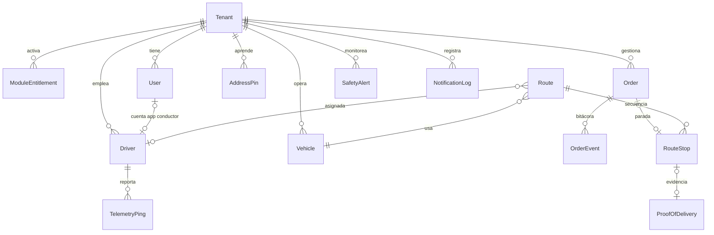

# MoveOS — Software Audit

Audit date: June 2026. Method: full code review of the 5 workspace packages,
automated test execution against a real PostgreSQL, and live browser
verification of both frontends.

**Scope note:** MoveOS is last-mile **delivery software only**. It does not
process, collect, record or reconcile payments. The former COD module was
removed by product decision; this audit verifies the removal (§8).

---

## 1. Verification status

| Check | Result |
|---|---|
| TypeScript build (5 packages) | 0 errors |
| Optimizer unit tests | 15/15 pass |
| API end-to-end tests (real Postgres) | 11/11 pass |
| Live browser tour (dashboard + driver app) | verified, screenshots in `docs/capturas/` |
| Payment references in code/docs | 0 (grep-verified) |

## 2. System architecture

The API is a **modular monolith**: paid modules are route groups registered
behind `requireModule(<key>)`. Disabling a module for a tenant makes its
endpoints return `403 MODULE_NOT_ENABLED` instantly and hides its navigation
in the dashboard. This delivers the commercial "core + toggleable modules"
model with no microservice overhead.

## 3. Process: order lifecycle (núcleo del negocio)

Every transition writes to the **bitácora** (`OrderEvent`): created, geocoded,
assigned, dispatched, in-transit, arrived, delivered/failed, notified. This is
the auditable trail visible in the orders table and the basis for the future
customer tracking page.

## 4. Process: operación diaria de despacho

The optimizer applies, per vehicle and date: **pico y placa** (city rules,
motos/EVs exempt), weight/volume capacity, time windows, a 10-hour shift cap,
urban speed profiles per vehicle type, and a **battery budget for EVs**
(nominal range derated by SoC, temperature, payload, elevation, minus a 15%
safety margin, including the return to depot).

## 5. Process: module gating (modelo comercial)

## 6. Data model (resumen)

13 tables, all tenant-scoped. Domain enums are strings validated by Zod/TS
unions (`@moveos/shared`) for cross-engine portability and migration-free
value evolution.

## 7. Security & multi-tenancy review

**In place:**
- JWT auth on every non-public route; tokens expire in 12 h.
- Every Prisma query filters by `tenantId` from the verified JWT; cross-tenant
  reads return 404.
- Role guards (`requireRole`): module toggles ADMIN-only; planning/dispatch
  ADMIN/DISPATCHER; drivers can only see and act on their own route
  (`findStopForUser` enforces ownership).
- All input validated with Zod; structured 400 responses.
- Passwords hashed with bcrypt (cost 10). Module gating enforced server-side.
- **Rate limiting** (global 300/min; login throttled to 10/min). *(closed)*
- **CORS allowlist** from `CORS_ORIGINS` env, no longer `origin: true`. *(closed)*
- **Helmet** security headers. *(closed)*
- **Fail-hard JWT secret**: production refuses to boot with a weak/default
  `JWT_SECRET` (<32 chars). *(closed)*
- **Engine-immobilization safety interlock**: `ENGINE_OFF` rejected unless the
  vehicle's last known speed is 0 (422 `VEHICLE_IN_MOTION`); every command is
  audit-logged. *(new)*

**Gaps remaining before production:**
- No refresh-token rotation; a 12 h token can't be revoked before expiry.
- POD photos/signatures stored as external URLs — signed-URL upload pipeline
  (S3/R2) pending.
- App-level tenant isolation only; Postgres **RLS** would add defense in depth.
  Note: the provisioned Supabase project has RLS disabled — mitigated because
  MoveOS uses a direct Postgres connection (not the anon key / PostgREST), but
  hardening is recommended (`docs/DEPLOYMENT.md`).

## 8. Payments removal (verified)

Removed in this change: the COD module (routes, UI page, driver collection
sheet), `CodPayment` and `CodSettlement` tables, `paymentType`/`codAmount`
order fields, payment methods, settlement/discrepancy logic, COD analytics and
all related docs/copy. Grep across code and docs returns **zero** payment
references; the schema was rebuilt and the full test suite passes. MoveOS
records *deliveries and evidence*, never money.

## 9. Known limitations / technical debt

| Area | Current state | Production path |
|---|---|---|
| Geocoding | Deterministic mock + learned pins | Wire Google/Lupap key into `GeocodeProvider` |
| Distances | Haversine × 1.4 urban factor | OSRM/VROOM road network behind same interface |
| Schema management | `prisma db push` | Switch to versioned `prisma migrate` |
| Dashboard refresh | Polling (15 s safety) | WebSockets/SSE for live ops |
| Notifications | Console adapter unless WhatsApp env set | WhatsApp Business API credentials + retry queue |
| Driver offline queue | localStorage | IndexedDB + idempotency keys |
| Telemetry transport | HTTP ingest + simulator | Aggregator (Flespi/Wialon) for real Teltonika/Queclink hardware |
| Engine immobilization | Command + simulated device ACK | Hardwired relay device + legal/insurer sign-off |
| RNDC / CX Pro / AI / Platform admin | Catalogued / planned | See `docs/MASTER_ROADMAP.md` |

## 10. Test inventory

| Suite | Tests | What they prove |
|---|---|---|
| `packages/optimizer` | 15 | Pico y placa (Bogotá par/impar, exenciones moto/EV, horarios, fin de semana), modelo de rango EV (SoC, frío, carga, elevación), VRP (capacidad, ventanas, espera, exclusiones explicadas, 2-opt factible) |
| `apps/api` | 11 | Registro multi-tenant, defaults de módulos, 401 sin token, geocodificación de dirección informal, guía MV-, plan→despacho→inicio→entrega con geocerca, AddressPin aprendido, bitácora completa, toggle de módulo (403/200), EV overview, pánico, analítica SPR |
