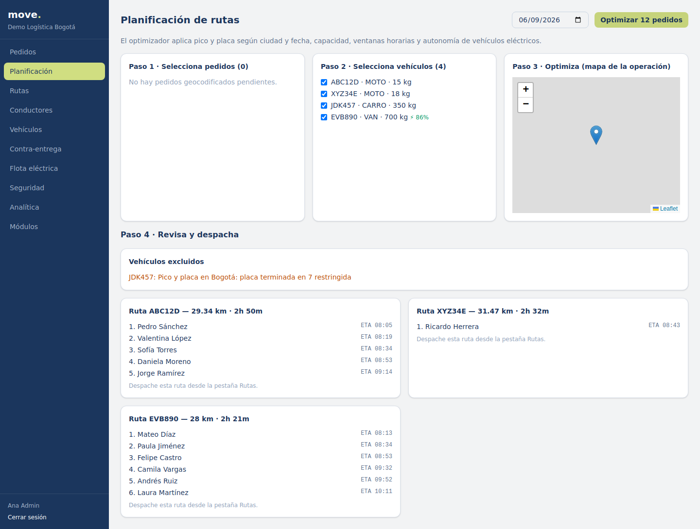
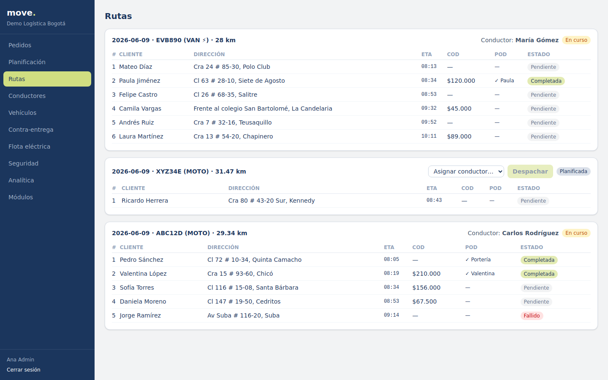
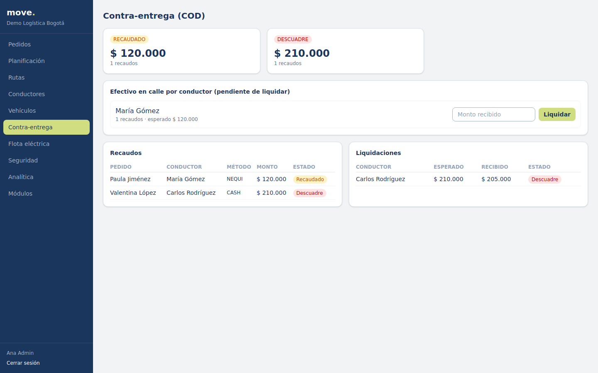
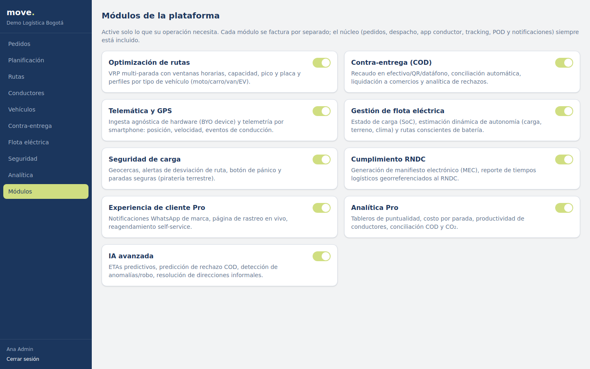
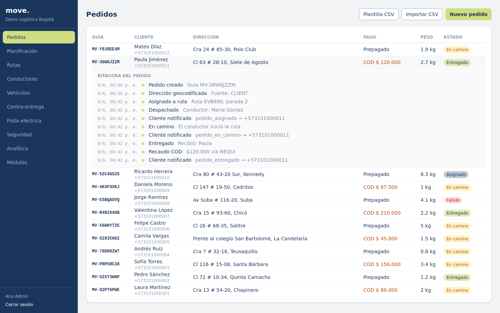
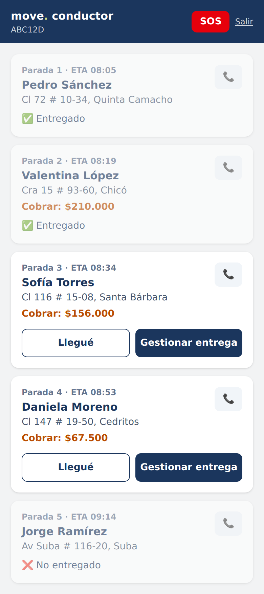

# MoveOS

**Plataforma SaaS modular de última milla para Colombia y LatAm.**

Modular last-mile delivery SaaS built Colombia-first: informal-address
geocoding, cash-on-delivery (contra-entrega) reconciliation, pico y placa
aware route optimization, motorcycle-fleet support, cargo-security alerts and
EV range management — packaged as a thin mandatory core plus per-tenant
toggleable modules.

## Monorepo layout

```
packages/
  shared/       Domain types, module catalog, Zod schemas, geo helpers
  optimizer/    VRP solver: nearest-neighbor + feasibility-checked 2-opt,
                pico y placa engine (per-city rules), dynamic EV range model
apps/
  api/          Fastify + Prisma/PostgreSQL modular monolith (multi-tenant)
  web/          Dispatcher dashboard (Vite + React + Tailwind, Spanish-first)
  driver/       Driver app (mobile-first PWA-style, offline action queue)
```

## The module model (core + toggles)

Every tenant gets the **mandatory core**: orders, dispatch, driver app,
real-time tracking, basic POD, customer notifications.

Paid modules are toggled per tenant (`ModuleEntitlement`) and enforced at the
API layer — a disabled module returns `403 MODULE_NOT_ENABLED`:

| Module key | What it does |
|---|---|
| `ROUTE_OPTIMIZATION` | Multi-stop VRP: capacity, time windows, **pico y placa** (plate/city/date), vehicle speed profiles (moto vs van), EV range budget |
| `COD` | Contra-entrega: collection (cash/QR/datáfono/Nequi/Daviplata), driver cash-in-street summary, settlements with discrepancy detection, rejection analytics |
| `TELEMATICS` | Smartphone telemetry today; hardware-agnostic GPS-device ingestion (fase 2) |
| `EV_MANAGEMENT` | SoC tracking, dynamic usable-range estimation (temp/payload/elevation), charging network map |
| `SAFETY` | Panic button, automatic route-deviation alerts (piratería terrestre) |
| `COMPLIANCE_RNDC` | RNDC/MEC manifest generation (fase 2) |
| `CUSTOMER_EXPERIENCE_PRO` | Branded WhatsApp notifications, live tracking page (fase 2) |
| `ANALYTICS_PRO` | Delivery success rate, distance, CO₂ estimate, COD funnel |
| `AI_ADDONS` | Predictive ETAs, COD-rejection prediction, theft anomaly detection (fase 3) |

Colombia-specific touches built into the core:

- **Tracking number + bitácora**: every order gets a human-readable guía
  (`MV-XXXXXXXX`) and an auditable event trail (created → geocoded → assigned
  → dispatched → in transit → delivered/failed, COD collection,
  notifications) — end-to-end traceability, expandable from the orders table.
- **CSV bulk import** with downloadable template, plus the `/orders/bulk` API.
- **Learned address graph** (`AddressPin`): every geo-stamped successful POD
  teaches the geocoder the real GPS pin for informal addresses
  ("frente al colegio San José") — a compounding data moat.
- **Pico y placa engine**: configurable per city; Bogotá (even/odd days,
  motos exempt) and Medellín (digit rotation) ship as defaults; EVs exempt
  nationally (Ley 1964/2019).
- **Document compliance**: SOAT / técnico-mecánica expiry alerts per vehicle.
- **COP-denominated money** (integer pesos), Spanish-first UI, WhatsApp-ready
  notification adapter.

## Quick start

Requires Node 20+, pnpm, and PostgreSQL (or Docker).

```bash
pnpm install
docker compose up -d                  # PostgreSQL 16 on :5432
cp .env.example apps/api/.env
pnpm --filter @moveos/api db:generate
pnpm --filter @moveos/api db:push
pnpm db:seed                          # demo tenant with Bogotá data

pnpm dev:api      # API on :3000
pnpm dev:web      # dashboard on :5173
pnpm dev:driver   # driver app on :5174
```

Demo credentials (seed):

| Email | Password | Role |
|---|---|---|
| `admin@demo.moveos.co` | `moveos123` | ADMIN |
| `despacho@demo.moveos.co` | `moveos123` | DISPATCHER |
| `carlos@demo.moveos.co` | `moveos123` | DRIVER (moto) |
| `maria@demo.moveos.co` | `moveos123` | DRIVER (e-van) |

## Tests

```bash
pnpm --filter @moveos/optimizer test   # 15 unit tests: VRP, pico y placa, EV range
pnpm --filter @moveos/api test         # 12 E2E tests: register → plan → deliver → reconcile
```

The API test suite needs `DATABASE_URL` pointing at a Postgres with the schema
applied (`pnpm --filter @moveos/api db:push`).

## Demo flow (5 minutes)

1. Log in to the dashboard as admin — the seed has 12 geocoded Bogotá orders
   (6 of them COD) and a mixed fleet: 2 motos, 1 gas car, 1 electric van.
2. **Planificación** → Optimizar: on an odd-numbered weekday the car with
   plate `JDK457` is excluded by pico y placa; motos and the EV (exempt)
   absorb the orders.
3. **Rutas** → assign a driver and dispatch (customers get notified).
4. Open the driver app as `carlos@…` → start the route → deliver stops,
   collecting COD with cash/QR; deliveries work offline and sync later.
5. **Contra-entrega** → see cash-in-street per driver, settle, and watch
   discrepancy detection if amounts don't match.
6. **Módulos** → toggle modules on/off and watch the nav and APIs react.

## Screenshots

Captured from the running product with the seeded demo data:

| | |
|---|---|
|  Route planning: `JDK457` excluded by pico y placa; motos + EV absorb the orders |  Dispatched routes with per-stop POD, COD and status |
|  COD reconciliation: cash-in-street per driver, settlement with a $5.000 discrepancy flagged |  Per-tenant module toggles — nav and APIs react instantly |
|  Order bitácora: tracking number + full auditable event trail | |



See [ARCHITECTURE.md](./ARCHITECTURE.md) for design decisions and
[ROADMAP.md](./ROADMAP.md) for the staged plan from the research brief.
