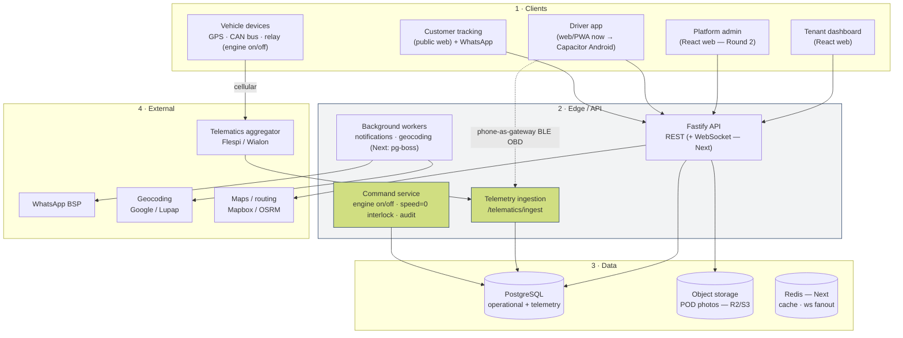
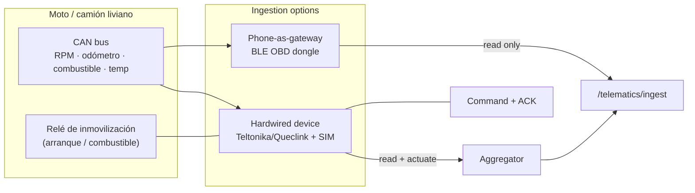
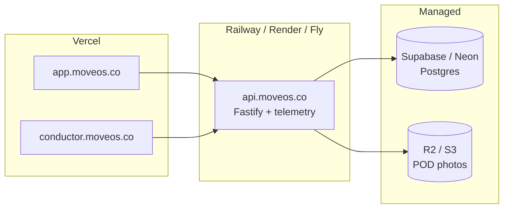

# MoveOS — Target Architecture

How MoveOS is built today and where it is going. The guiding principle: the
**telemetry/IoT plane is separate from the web plane** — different protocols,
scaling, and hosting — which is why MoveOS is not a single serverless app.

## Four tiers

## The telemetry plane (why it's separate)

A delivery REST request is short and user-driven. A fleet of vehicles emits a
**continuous high-frequency stream** of GPS + CAN pings that must be ingested,
normalized, rule-checked (geofence, deviation, speeding, low battery), stored,
and pushed to the live map. That workload:

- needs a **persistent process** (can't run on short-lived serverless
  functions) — so the API + telemetry live on a container host, not Vercel;
- scales on a **different axis** (pings/sec, not page views);
- is **transport-agnostic** in MoveOS: the simulator, the driver's phone, or a
  hardware aggregator all POST normalized pings to the same
  `/telematics/ingest`. Swapping the simulator for real devices changes
  nothing upstream.

## GPS / CAN / engine on-off — the hardware reality

Two honest constraints baked into the design:

1. **Reading telemetry** (GPS + CAN) works via either a cheap **phone-gateway
   BLE OBD dongle** (start here, no per-vehicle cost) or a **hardwired
   device** (reliable, works without the phone). Start cheap, upgrade when a
   pilot proves value.
2. **Engine on/off is a relay, not a CAN write.** Real immobilization is a
   relay on the starter/fuel circuit on a **hardwired device** — it cannot be
   done through a phone OBD dongle. MoveOS models it as a **command + device
   acknowledgement** (`VehicleCommand`), never a raw CAN write.
3. **Safety interlock:** the API **refuses `ENGINE_OFF` unless last known
   speed = 0**. Cutting a moving vehicle is dangerous and, in many places,
   illegal. Every command is audit-logged (who, when, why, ack). See the
   legal/safety section in `MASTER_ROADMAP.md`.

## Hosting topology

- **Frontends → Vercel/Cloudflare Pages**: static, cheap, global.
- **API + telemetry → container host**: persistent server, holds
  WebSocket + ingestion. *Not* Vercel.
- **Postgres → Supabase/Neon**: managed, provisioned for this project.
- **Object storage → R2/S3**: signed-URL POD upload (pending).

See `DEPLOYMENT.md` for the step-by-step.

## Current vs target (delta)

| Concern | Today | Target |
|---|---|---|
| API | Fastify modular monolith ✓ | + WebSocket, + workers (pg-boss) |
| Telemetry | ingestion + simulator ✓ | + aggregator adapter, partition/retention |
| Realtime | polling (3 s map) | SSE/WebSocket |
| Auth | JWT 12 h, rate-limit, CORS allowlist, helmet ✓ | + refresh-token rotation |
| DB | Postgres, app-level tenant scoping ✓ | + RLS defense-in-depth |
| Storage | external POD URLs | signed-URL uploads (R2/S3) |
| Driver app | web/PWA ✓ | Capacitor Android (bg GPS, BLE, push) |
| Migrations | `prisma db push` | versioned `prisma migrate` |
