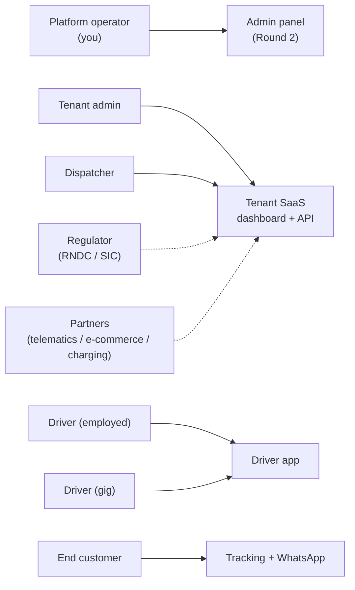

# MoveOS — Master Audit & Roadmap

Comprehensive plan to make MoveOS the most complete last-mile delivery
platform for Colombia and LatAm, divided by **product surface** and
**engineering discipline**, with stakeholders and phases.

- **Scope charter:** delivery software only — **no payment processing,
  collection, or reconciliation** of any kind (product decision).
- **Phases:** **Now** (0–6 mo / pilot-ready), **Next** (6–18 mo / up-market),
  **Later** (18 mo+ / differentiation & regional).
- Companion docs: `AUDIT.md` (technical audit + diagrams),
  `ARCHITECTURE_TARGET.md` (architecture & hosting), `DEPLOYMENT.md`.

---

## 1. Product surfaces

## 2. Current-state audit (what exists today, verified in code)

| Surface | Built |
|---|---|
| **Driver app** | Login, today's route, start/arrive/complete with geofenced POD, fail reasons, **offline action queue**, SOS panic, telemetry pings (GPS + SoC) |
| **Tenant SaaS** | Orders (tracking guía `MV-`, **bitácora** audit trail, CSV import + template), 4-step planning (pico y placa + EV range + capacity + time windows + map), dispatch, route monitoring, drivers, vehicles (SOAT/tecno expiry alerts), EV fleet (SoC/range), safety center, analytics (SPR/SPH/CO₂), **module entitlement toggles**, REST API |
| **Telematics/IoT** | **GPS + CAN telemetry ingestion, live ops map, engine on/off immobilization with speed=0 interlock + audit, device simulator** (this round) |
| **Security** | JWT (12 h), per-tenant query scoping, role guards, Zod validation, bcrypt, **rate limiting, CORS allowlist, helmet, fail-hard prod JWT secret** (this round) |
| **Platform admin** | — (Round 2) |
| **End customer** | WhatsApp notification adapter (console in dev) |

Test coverage: 15 optimizer unit tests + 16 API e2e tests (incl. telematics).

## 3. Roadmap by surface

### (a) Driver app  — stakeholders: employed & gig drivers
| Phase | Items |
|---|---|
| **Now** | IndexedDB offline queue + idempotency keys; PWA manifest/installability; **POD photo capture + compression + signed upload**; navigation deep links (Google Maps/Waze); barcode/QR scan at handover; richer fail flows with photo; battery-aware telemetry cadence |
| **Next** | **Capacitor Android** (background GPS, FCM push, camera, **BLE OBD/CAN read**); dispatcher↔driver chat; **shift check-in/out + inspección preoperacional** (Colombian fleet requirement); driver document wallet (licencia/SOAT/tecno) with expiry nudges; proof-of-pickup + multi-pickup; EV SoC entry/OBD; gig onboarding (KYC, background check) |
| **Later** | Offline map tiles; voice guidance; crash/fall detection via sensors; fatigue scoring; iOS |

### (b) Tenant SaaS — stakeholders: tenant admin, dispatcher
| Phase | Items |
|---|---|
| **Now** | Live ops map (✓ via telemetry); **SSE/WebSocket** replacing polling; order edit/cancel/reschedule; **exception/triage board** for failed deliveries; user management UI (invite, roles, reset); manual route editing (reorder/reassign); **public tokenized tracking page**; tenant API keys + OpenAPI; outbound webhooks (order.created/delivered/failed); CSV export |
| **Next** | Zones/service areas + coverage rules; multi-depot; paired pickup+delivery; recurring orders; SLA config + breach alerts; **returns / reverse logistics**; label & manifest PDFs; per-tenant branding (tracking page + WhatsApp templates); auto-assign dispatch rules; **driver scorecards** (SPR/SPH/punctuality); tenant audit log; customer address book reusing AddressPin; CSAT/NPS post-delivery |
| **Later** | Carrier marketplace / broker mode; dynamic same-day batching; customer delivery-slot booking; multi-city control tower; white-label tenant portals |

### (c) Platform admin panel — stakeholder: platform operator (you)
| Phase | Items |
|---|---|
| **Now ✓ (built)** | Separate JWT plane with cross-plane leak guard, tenant list/detail, suspend/reactivate (immediate, TTL-cached), plan label, module entitlement overrides, platform metrics (orders/day, module adoption), second demo tenant. `apps/admin` on :5175 |
| **Next** | **Impersonation** ("enter as tenant") with mandatory audit trail; `PlatformAuditLog`; plan quotas (orders/seats) with soft enforcement + upgrade prompts (**usage reports only — invoicing stays outside the product**); tenant health/activation scores; feature flags decoupled from commercial modules; registration approval flow; entitlement `lockedByPlatform` |
| **Later** | Reseller/partner management (telematics channel); per-tenant data residency; usage anomaly detection; compliance evidence automation |

### (d) End-customer experience — stakeholder: end customer
| Phase | Items |
|---|---|
| **Now** | WhatsApp **production credentials** (adapter ready); live tracking page with ETA + driver position; self-serve reschedule |
| **Next** | Two-way WhatsApp chat; delivery preferences (vecino, portería); ratings; **habeas-data self-service** (access/rectify/delete) |
| **Later** | WhatsApp status bot; PUDO/locker pickup |

### (e) Telematics / IoT — stakeholders: dispatcher, operator, insurers
| Phase | Items |
|---|---|
| **Now** | Ingestion + live map + engine on/off + simulator (✓) |
| **Next** | **Aggregator adapter (Flespi/Wialon)** for real Teltonika/Queclink devices; phone-gateway BLE OBD in the driver app; geofenced safe corridors; trusted-stop enforcement; telemetry retention/partitioning |
| **Later** | Predictive maintenance from CAN fault codes; driver-behavior scoring; OEM EV SoC APIs; insurance telematics integrations |

## 4. Cross-cutting engineering

**Backend** — Now: versioned `prisma migrate`; signed-URL POD upload pipeline (R2/S3); pagination on all lists; idempotency keys (CSV re-import safety); structured logs + request IDs; pg-boss job queue. Next: Postgres **RLS** defense-in-depth; **OSRM/VROOM** road-network distances behind the optimizer interface; telemetry partitioning + retention; event outbox for reliable webhooks; pico y placa rules as data per city; API versioning. Later: telemetry streaming pipeline; CQRS-lite read models; multi-region.

**Frontend** — Now: extract **shared UI package** (3 apps duplicate `ui.tsx`); TanStack Query; error boundaries/toasts; Playwright smoke per app; map marker clustering. Next: Move design-system tokens package; Storybook; **i18n** (es-CO → pt-BR, en); accessibility pass; printable manifests. Later: embeddable tracking widget.

**Mobile** — Now: PWA hardening. Next: **Capacitor Android** (Play Store, background geolocation, push, BLE); MDM guidance for employed fleets. Later: iOS; phone-as-tracker mode.

**Data / AI** (feeds `AI_ADDONS`) — Now: KPI definitions doc (SPR/SPH/OTD/success/CO₂); nightly warehouse export; geocoding-accuracy monitors. Next: predictive ETAs; **failed-delivery risk score** (the `failureReason` corpus is already accumulating); **informal-address resolution ML** over the AddressPin graph; zone demand forecasting; theft anomaly detection (deviation + long-stop → SAFETY). Later: anonymized cross-tenant benchmarks; LLM ops copilot over the bitácora.

**Infra / DevOps** — Now: **CI** (typecheck + optimizer unit + API e2e with a Postgres service container); Dockerfiles (✓); env separation; Sentry; DB backups + restore drill; uptime checks. Next: IaC; blue-green deploys; migration gating in CI; k6 load tests on telemetry ingest; OpenTelemetry tracing. Later: SLOs; chaos drills; edge caching for tracking pages.

**QA** — Now: extend e2e to **cross-tenant access fuzzing** + role/entitlement matrices; optimizer property-based tests; test data factories; isolated test DB per CI run. Next: VRP golden-file regression; device-farm testing for the driver app; dependency/secret scanning. Later: synthetic monitoring of the order→delivery journey; mutation testing.

## 5. Security & compliance (Colombia-first)

**Now** — Close the remaining `AUDIT.md` §7 items (rate-limit ✓, CORS ✓, prod JWT guard ✓, helmet ✓; **refresh-token rotation** pending). **Ley 1581 (habeas data):** privacy policy + consent basis for end-customer phone/location; tenants are *responsables*, MoveOS is *encargado* → **DPA template**; data-subject request process; **retention policy** (especially `TelemetryPing` and POD photos); PII minimization in logs; assess RNBD (SIC) registration.

**Next** — `COMPLIANCE_RNDC` module: **MEC** electronic manifest, georeferenced *tiempos logísticos* web service (Decreto 1017/2025), SICE-TAC validation; SOAT/tecno expiry **blocking dispatch** (fields already on `Vehicle`); **engine-immobilization legal/safety** policy (speed=0 interlock ✓, insurer sign-off, driver consent); encryption at rest + key rotation; penetration test; incident-response runbook; driver KYC handling. **Database:** enable Postgres RLS or disable PostgREST data API (the provisioned Supabase project has RLS off — see `DEPLOYMENT.md`).

**Later** — ISO 27001 / SOC2 path; country packs (Mexico **Carta Porte**, Peru **GRE**, Chile); cargo-insurance integrations.

## 6. Integrations

**Now** — public REST + API keys + webhooks; **WhatsApp Business API** production credentials (**BSP selection is a long-lead commercial dependency — start now**); production geocoding key (Google/Lupap — `GeocodeProvider` interface exists).

**Next** — **VTEX / Shopify / Mercado Libre** order-sync; **Siigo** (and World Office) ERP; **telematics aggregator** (Flespi/Wialon) + hardware (Teltonika/Queclink/Suntech); **charging networks** (Terpel Voltex, Enel X availability; OCPP for depot chargers); navigation deep links.

**Later** — EDI for enterprise shippers; OEM EV APIs for SoC; smart lockers/PUDO; engine shut-off via telematics partners; marketplace fulfillment programs.

## 7. Stakeholder matrix

| Stakeholder | Core needs | Key features | Phase emphasis |
|---|---|---|---|
| Platform operator (you) | Manage tenants, plans, health, support | Admin panel, metrics, impersonation, audit log | Round 2 / Next |
| Tenant admin | Configure ops, users, modules, compliance, branding | Module toggles ✓, user mgmt, RNDC, branding | Now → Next |
| Dispatcher | Plan, monitor, resolve exceptions | Planning ✓, live map ✓, exception board, manual edit | Now |
| Driver (employed) | Clear route, evidence, safety, shifts | Driver app ✓, checklists, document wallet | Now → Next |
| Driver (gig) | Fast onboarding, fair assignment, ratings | KYC onboarding, assignment, scorecards | Next |
| End customer | Visibility, notifications, control, privacy | Tracking page, WhatsApp, reschedule, habeas-data | Now → Next |
| Regulator (RNDC/SIC) | Manifests, reporting, audit, data rights | RNDC module, bitácora ✓, retention, DPA | Next |
| Partners | Channel, integration, co-sell | Reseller mgmt, aggregator/e-commerce/charging APIs | Next → Later |

## 8. Decision triggers & risks

**Triggers** — If SimpliRoute or a global player localizes RNDC aggressively → accelerate the compliance moat + channel partners. If Ley 2486 e-moto registration formalizes → prioritize e-moto profiles. If a pilot shows telematics drives retention → commit to hardware procurement.

**Risks / blind spots** — (1) **Validation lag**: engineering is ahead of market proof; run a real moto-courier pilot before broadening. (2) **Hardware commitment**: start phone-gateway + simulator; don't buy devices until value is proven. (3) **Engine-kill liability**: keep simulator-only until legal + insurance sign-off; never relax the speed=0 interlock. (4) **WhatsApp BSP** is a long-lead dependency blocking most of the customer-experience module. (5) **Driver labor-model compliance** (employed vs gig classification) shapes the gig roadmap more than any technical choice. (6) **Roadmap shelfware**: every item above binds to a surface, a stakeholder, and a phase — revisit quarterly against the pilot.
